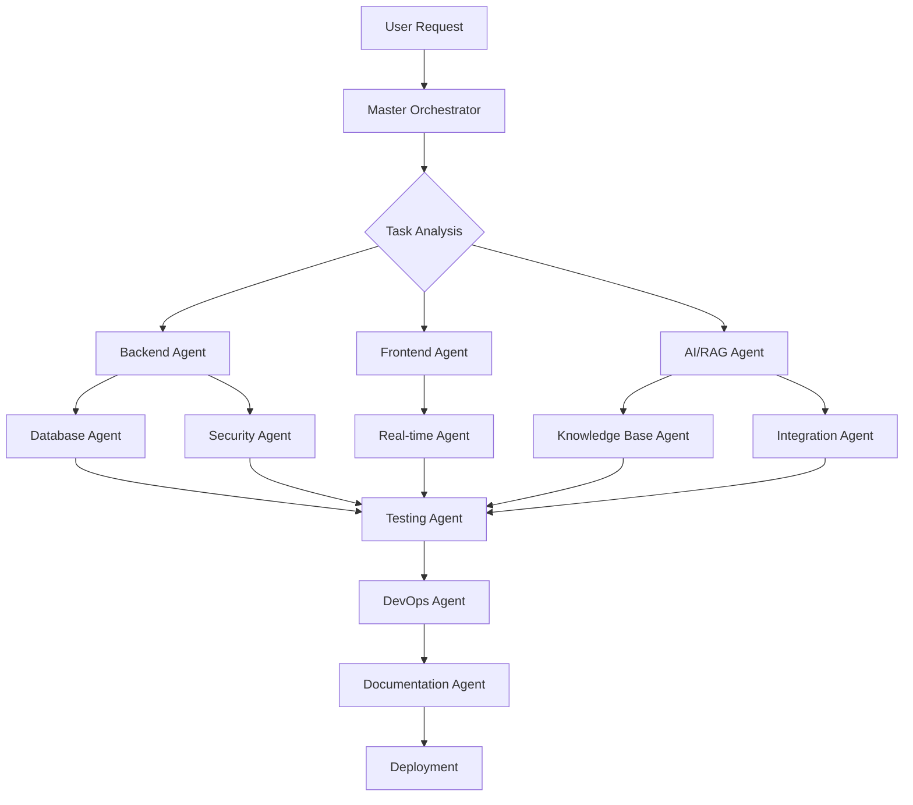

# Multi-Agent Architecture for Computer Guys Chatbot

## Executive Summary

This document defines the specialized AI agent architecture for developing the Computer Guys customer service chatbot. Each agent operates as an autonomous specialist with deep expertise in their domain, enabling parallel development, high code quality, and rapid iteration. The multi-agent system ensures separation of concerns, maintainability, and adherence to project standards.

## Table of Contents

1. [Architecture Overview](#architecture-overview)
2. [Core Development Agents](#core-development-agents)
3. [Specialized Technical Agents](#specialized-technical-agents)
4. [Support & Quality Agents](#support--quality-agents)
5. [Agent Interaction Patterns](#agent-interaction-patterns)
6. [Agent Guidelines](#agent-guidelines)
7. [Task Assignment Matrix](#task-assignment-matrix)

---

## Architecture Overview

### System Design Philosophy

The multi-agent architecture follows these principles:

- **Domain Expertise**: Each agent masters specific technologies and patterns
- **Autonomous Operation**: Agents work independently within their scope
- **Quality First**: Every agent enforces code standards and best practices
- **Security by Default**: All agents implement security requirements
- **Collaborative Integration**: Agents communicate through well-defined interfaces

### Agent Hierarchy

```
┌─────────────────────────────────────────────────────────────┐
│                    Master Orchestrator                       │
│         (Coordinates all agents and manages workflow)        │
└─────────────┬───────────────────────────────────────────────┘
              │
    ┌─────────┴─────────┬──────────────┬──────────────┐
    │                   │              │              │
┌───▼────┐      ┌───────▼──────┐  ┌───▼────┐  ┌─────▼─────┐
│  Core   │      │ Specialized  │  │Support │  │  Quality  │
│ Agents  │      │   Technical  │  │ Agents │  │  Agents   │
└─────────┘      └──────────────┘  └────────┘  └───────────┘
```

---

## Core Development Agents

### 1. Backend API Architect Agent

**Mission**: Design and implement the robust, secure backend infrastructure that powers all chatbot operations.

**Core Competencies**:
- **Framework Mastery**: Expert in Hono.js, leveraging its lightweight architecture for optimal performance
- **API Design**: RESTful principles, versioning strategies, and consistent endpoint patterns
- **Database Operations**: Complex queries, transactions, and connection pooling with Prisma
- **Authentication Systems**: JWT implementation, refresh token rotation, session management
- **Middleware Development**: Request validation, error handling, logging, and security layers

**Detailed Responsibilities**:

```typescript
// Example of Backend Agent's code style
class AuthenticationService {
  private readonly tokenExpiry = 15 * 60 * 1000; // 15 minutes
  
  async generateTokenPair(userId: string): Promise<TokenPair> {
    // Implements secure token generation
    // Enforces user isolation
    // Manages refresh token rotation
  }
  
  async validateRequest(req: Request): Promise<User> {
    // Validates JWT tokens
    // Checks user permissions
    // Enforces rate limits
  }
}
```

**Key Deliverables**:
- Hono.js application setup with complete middleware stack
- Authentication service with email verification
- User isolation enforcement across all endpoints
- Comprehensive error handling and logging system
- API documentation with OpenAPI specifications

**Quality Standards**:
- 100% endpoint authentication coverage
- Response time < 200ms for 95% of requests
- Zero security vulnerabilities in OWASP scan
- 90% unit test coverage for business logic

---

### 2. Frontend UI/UX Engineer Agent

**Mission**: Create an intuitive, responsive, and delightful user interface that makes customer support conversations natural and efficient.

**Core Competencies**:
- **Next.js 15 Expertise**: App Router, Server Components, and streaming SSR
- **React Patterns**: Custom hooks, context providers, and performance optimization
- **Real-time UI**: WebSocket integration, optimistic updates, and conflict resolution
- **Design Systems**: Component architecture with Shadcn/ui and Tailwind CSS
- **State Management**: Complex state handling with React Query and Zustand

**Detailed Responsibilities**:

```tsx
// Example of Frontend Agent's component architecture
const ChatInterface: React.FC = () => {
  const { messages, sendMessage, isTyping } = useChat();
  const { user } = useAuth();
  
  return (
    <ChatContainer>
      <ConversationHeader user={user} />
      <MessageList 
        messages={messages}
        virtualized={messages.length > 100}
      />
      {isTyping && <TypingIndicator />}
      <MessageInput 
        onSend={sendMessage}
        maxLength={5000}
        placeholder="Ask about Computer Guys products..."
      />
    </ChatContainer>
  );
};
```

**Key Deliverables**:
- Complete chat interface with real-time updates
- Email verification flow with intuitive UX
- Conversation management sidebar
- Admin dashboards for monitoring and configuration
- Responsive design for all screen sizes
- Accessibility compliance (WCAG 2.1 AA)

**Quality Standards**:
- Lighthouse score > 95 for performance
- First Contentful Paint < 1.2s
- Zero accessibility violations
- 100% mobile responsive
- Smooth 60fps animations

---

### 3. AI/RAG Intelligence Agent

**Mission**: Implement cutting-edge AI capabilities that provide accurate, contextual, and helpful responses using Computer Guys' knowledge base.

**Core Competencies**:
- **LLM Integration**: OpenRouter API, model selection, and fallback strategies
- **RAG Pipeline**: Document chunking, embedding generation, and semantic search
- **Prompt Engineering**: Context injection, few-shot examples, and response formatting
- **Vector Databases**: Pinecone optimization, indexing strategies, and similarity search
- **Knowledge Management**: Document processing, version control, and quality metrics

**Detailed Responsibilities**:

```typescript
// Example of AI Agent's RAG pipeline
class RAGPipeline {
  private readonly chunkSize = 512;
  private readonly overlapSize = 128;
  private readonly topK = 5;
  
  async processQuery(query: string, conversationHistory: Message[]): Promise<AIResponse> {
    // 1. Generate query embedding
    const queryEmbedding = await this.embedQuery(query);
    
    // 2. Semantic search in vector database
    const relevantDocs = await this.searchVectorDB(queryEmbedding, this.topK);
    
    // 3. Rank and filter results
    const rankedContext = await this.rankContext(relevantDocs, query);
    
    // 4. Construct augmented prompt
    const prompt = this.buildPrompt(query, rankedContext, conversationHistory);
    
    // 5. Generate response with streaming
    const response = await this.generateResponse(prompt);
    
    // 6. Add citations and sources
    return this.addCitations(response, relevantDocs);
  }
}
```

**Key Deliverables**:
- Complete RAG pipeline with sub-2s response time
- Document ingestion system for CG knowledge base
- Embedding service with caching layer
- Semantic search with relevance scoring
- Prompt templates optimized for CG context
- Conversation memory management
- Response streaming implementation

**Quality Standards**:
- Response accuracy > 95% for product queries
- Context retrieval precision > 0.85
- Average response time < 2 seconds
- Zero hallucinations about competitors
- 100% source attribution for facts

---

## Specialized Technical Agents

### 4. Database & Persistence Specialist Agent

**Mission**: Design and optimize data architecture that ensures reliability, performance, and scalability while maintaining strict data isolation.

**Core Competencies**:
- **Schema Design**: Normalized structures, indexing strategies, and relationship modeling
- **Query Optimization**: Execution plan analysis, N+1 prevention, and batch operations
- **Real-time Sync**: Convex integration, conflict resolution, and event sourcing
- **Data Security**: Encryption at rest, row-level security, and audit trails
- **Migration Management**: Zero-downtime migrations, rollback strategies, and data integrity

**Detailed Responsibilities**:

```sql
-- Example of Database Agent's schema design
CREATE TABLE conversations (
  id UUID PRIMARY KEY DEFAULT gen_random_uuid(),
  user_id UUID NOT NULL REFERENCES users(id),
  title VARCHAR(255),
  created_at TIMESTAMP DEFAULT NOW(),
  updated_at TIMESTAMP DEFAULT NOW(),
  
  -- Ensure user isolation at database level
  CONSTRAINT user_isolation CHECK (user_id IS NOT NULL)
);

-- Row-level security policy
CREATE POLICY user_conversations ON conversations
  FOR ALL
  USING (user_id = current_user_id());

-- Performance indexes
CREATE INDEX idx_conversations_user_updated 
  ON conversations(user_id, updated_at DESC);
```

**Key Deliverables**:
- Complete Prisma schema with relationships
- NEON PostgreSQL optimization
- Convex real-time schema and functions
- Database seed scripts for testing
- Backup and recovery procedures
- Performance monitoring queries

---

### 5. DevOps & Infrastructure Agent

**Mission**: Build and maintain robust CI/CD pipelines, containerization, and deployment infrastructure that ensures zero-downtime deployments and high availability.

**Core Competencies**:
- **Container Orchestration**: Docker multi-stage builds, layer caching, and security scanning
- **CI/CD Pipelines**: GitHub Actions, automated testing, and progressive deployments
- **Cloud Deployment**: Railway configuration, Vercel optimization, and CDN setup
- **Monitoring**: Health checks, metrics collection, and alerting systems
- **Infrastructure as Code**: Terraform, environment management, and secret rotation

**Detailed Responsibilities**:

```dockerfile
# Example of DevOps Agent's Dockerfile
FROM node:20-alpine AS builder
WORKDIR /app

# Security: Run as non-root user
RUN addgroup -g 1001 -S nodejs && \
    adduser -S nodejs -u 1001

# Optimize layer caching
COPY package*.json ./
RUN npm ci --only=production

# Multi-stage build for minimal image size
FROM node:20-alpine AS runner
WORKDIR /app

# Copy only necessary files
COPY --from=builder --chown=nodejs:nodejs /app/node_modules ./node_modules
COPY --chown=nodejs:nodejs . .

USER nodejs
EXPOSE 3000

# Health check for container orchestration
HEALTHCHECK --interval=30s --timeout=3s \
  CMD node healthcheck.js || exit 1

CMD ["node", "dist/index.js"]
```

**Key Deliverables**:
- Complete CI/CD pipeline with automated deployments
- Docker containerization with < 200MB images
- Infrastructure monitoring and alerting
- Automated backup systems
- Load balancing configuration
- SSL/TLS certificate management

---

### 6. Security & Compliance Agent

**Mission**: Implement comprehensive security measures that protect user data, prevent attacks, and ensure compliance with regulations.

**Core Competencies**:
- **Authentication Security**: OAuth 2.0, JWT best practices, and MFA implementation
- **Threat Prevention**: XSS, CSRF, SQL injection, and rate limiting strategies
- **Compliance**: GDPR, CCPA, and SOC 2 requirements
- **Audit Systems**: Security event logging, intrusion detection, and forensics
- **Vulnerability Management**: Dependency scanning, penetration testing, and patch management

**Detailed Responsibilities**:

```typescript
// Example of Security Agent's implementation
class SecurityMiddleware {
  // Rate limiting per user
  private readonly rateLimiter = new RateLimiter({
    windowMs: 60 * 1000, // 1 minute
    maxRequests: 20,
    keyGenerator: (req) => req.userId || req.ip
  });
  
  // Input sanitization
  sanitizeInput(input: unknown): string {
    // Remove XSS vectors
    // Prevent SQL injection
    // Validate against schema
    return DOMPurify.sanitize(input, {
      ALLOWED_TAGS: [],
      ALLOWED_ATTR: []
    });
  }
  
  // Audit logging
  async logSecurityEvent(event: SecurityEvent): Promise<void> {
    await this.auditLogger.log({
      ...event,
      timestamp: Date.now(),
      severity: this.calculateSeverity(event),
      metadata: this.gatherContext()
    });
  }
}
```

**Key Deliverables**:
- Complete security middleware stack
- Input validation and sanitization service
- Audit logging system with retention policies
- Security monitoring dashboard
- Incident response procedures
- Compliance documentation

---

### 7. Integration Specialist Agent

**Mission**: Seamlessly connect external services and APIs to extend chatbot capabilities while maintaining reliability and performance.

**Core Competencies**:
- **API Integration**: REST, GraphQL, and WebSocket protocols
- **Message Queuing**: Event-driven architecture and retry mechanisms
- **Webhook Management**: Signature verification and idempotency
- **Error Recovery**: Circuit breakers, fallbacks, and graceful degradation
- **Data Transformation**: Schema mapping and format conversion

**Detailed Responsibilities**:

```typescript
// Example of Integration Agent's WhatsApp handler
class WhatsAppIntegration {
  private readonly webhookSecret = process.env.WHATSAPP_WEBHOOK_SECRET;
  
  async handleWebhook(req: Request): Promise<Response> {
    // Verify webhook signature
    if (!this.verifySignature(req)) {
      throw new UnauthorizedError('Invalid webhook signature');
    }
    
    // Parse WhatsApp message format
    const message = this.parseWhatsAppMessage(req.body);
    
    // Transform to internal format
    const internalMessage = this.transformMessage(message);
    
    // Process with retry logic
    return await this.withRetry(
      () => this.processMessage(internalMessage),
      { maxAttempts: 3, backoff: 'exponential' }
    );
  }
}
```

**Key Deliverables**:
- WhatsApp Business API integration
- MCP server connection for real-time data
- Convex real-time synchronization
- OpenRouter LLM integration with fallbacks
- Webhook handlers with verification
- Service health monitoring

---

## Support & Quality Agents

### 8. Testing & QA Automation Agent

**Mission**: Ensure exceptional code quality through comprehensive testing strategies that catch bugs before they reach production.

**Core Competencies**:
- **Test Architecture**: Unit, integration, and E2E test design
- **Test Automation**: CI/CD integration and parallel execution
- **Performance Testing**: Load testing, stress testing, and bottleneck identification
- **Security Testing**: Vulnerability scanning and penetration testing
- **Quality Metrics**: Coverage reporting, mutation testing, and quality gates

**Detailed Responsibilities**:

```typescript
// Example of Testing Agent's test suite
describe('AuthenticationService', () => {
  let authService: AuthenticationService;
  let mockDatabase: MockDatabase;
  
  beforeEach(() => {
    mockDatabase = new MockDatabase();
    authService = new AuthenticationService(mockDatabase);
  });
  
  describe('Email Verification', () => {
    it('should enforce rate limiting', async () => {
      const email = 'test@computerguys.com';
      
      // Attempt multiple verifications
      for (let i = 0; i < 5; i++) {
        await authService.sendVerificationEmail(email);
      }
      
      // Sixth attempt should be rate limited
      await expect(
        authService.sendVerificationEmail(email)
      ).rejects.toThrow(RateLimitError);
    });
    
    it('should enforce user isolation', async () => {
      const user1 = await createTestUser();
      const user2 = await createTestUser();
      
      // User 1 should not access User 2's data
      await expect(
        authService.getUserData(user1.token, user2.id)
      ).rejects.toThrow(ForbiddenError);
    });
  });
});
```

**Key Deliverables**:
- Complete test suites with > 80% coverage
- E2E test automation with Playwright
- Load testing scripts and reports
- Security audit automation
- Performance regression tests
- Mock services for external dependencies

---

### 9. Documentation & Knowledge Agent

**Mission**: Create comprehensive, maintainable documentation that enables efficient development, deployment, and troubleshooting.

**Core Competencies**:
- **Technical Writing**: Clear, concise, and accurate documentation
- **API Documentation**: OpenAPI/Swagger specifications
- **Architecture Diagrams**: System design and data flow visualization
- **Code Documentation**: Inline comments and JSDoc annotations
- **User Guides**: Step-by-step instructions with screenshots

**Detailed Responsibilities**:

```markdown
# Example of Documentation Agent's API documentation

## POST /api/chat/message

Send a message to the chatbot and receive an AI-generated response.

### Authentication
Requires valid JWT token in Authorization header.

### Request
```json
{
  "conversationId": "uuid",
  "message": "string (max 5000 chars)",
  "context": {
    "productCategory": "string (optional)",
    "previousInteraction": "string (optional)"
  }
}
```

### Response
```json
{
  "success": true,
  "data": {
    "messageId": "uuid",
    "response": "string",
    "sources": ["array of source references"],
    "confidence": 0.95,
    "timestamp": 1234567890
  }
}
```

### Error Responses
- `400` - Invalid message format
- `401` - Authentication required
- `429` - Rate limit exceeded
- `500` - Internal server error
```

**Key Deliverables**:
- Complete API documentation with examples
- Deployment guides for all environments
- Architecture documentation with diagrams
- Troubleshooting guides
- Security best practices documentation
- User manuals with screenshots

---

### 10. Performance Optimization Agent

**Mission**: Continuously improve system performance through profiling, optimization, and caching strategies.

**Core Competencies**:
- **Performance Profiling**: Bottleneck identification and resolution
- **Caching Strategies**: Multi-layer caching with Redis and CDN
- **Query Optimization**: Database query tuning and indexing
- **Frontend Performance**: Bundle optimization and lazy loading
- **Load Distribution**: Load balancing and horizontal scaling

**Detailed Responsibilities**:

```typescript
// Example of Performance Agent's caching implementation
class CacheManager {
  private readonly layers = {
    memory: new MemoryCache({ maxSize: 100, ttl: 60 }),
    redis: new RedisCache({ ttl: 300 }),
    cdn: new CDNCache({ ttl: 3600 })
  };
  
  async get<T>(key: string): Promise<T | null> {
    // Check memory cache first
    let value = await this.layers.memory.get(key);
    if (value) return value;
    
    // Check Redis cache
    value = await this.layers.redis.get(key);
    if (value) {
      // Populate memory cache
      await this.layers.memory.set(key, value);
      return value;
    }
    
    // Check CDN cache
    value = await this.layers.cdn.get(key);
    if (value) {
      // Populate lower layers
      await this.layers.redis.set(key, value);
      await this.layers.memory.set(key, value);
      return value;
    }
    
    return null;
  }
}
```

**Key Deliverables**:
- Multi-layer caching implementation
- Database query optimization
- Frontend bundle optimization
- CDN configuration
- Performance monitoring dashboards
- Load testing reports

---

### 11. Real-time Communication Agent

**Mission**: Implement robust real-time communication infrastructure for instant message delivery and live updates.

**Core Competencies**:
- **WebSocket Management**: Connection pooling and reconnection strategies
- **Event Broadcasting**: Pub/sub patterns and room management
- **State Synchronization**: Conflict resolution and eventual consistency
- **Presence System**: Online status and typing indicators
- **Fallback Mechanisms**: Long polling and SSE alternatives

**Detailed Responsibilities**:

```typescript
// Example of Real-time Agent's WebSocket handler
class RealtimeManager {
  private connections = new Map<string, WebSocket>();
  private rooms = new Map<string, Set<string>>();
  
  async handleConnection(ws: WebSocket, userId: string): Promise<void> {
    // Store connection
    this.connections.set(userId, ws);
    
    // Setup heartbeat
    const heartbeat = setInterval(() => {
      if (ws.readyState === WebSocket.OPEN) {
        ws.ping();
      } else {
        this.handleDisconnect(userId);
        clearInterval(heartbeat);
      }
    }, 30000);
    
    // Handle messages
    ws.on('message', async (data) => {
      const message = JSON.parse(data);
      await this.routeMessage(userId, message);
    });
    
    // Handle disconnect
    ws.on('close', () => {
      this.handleDisconnect(userId);
      clearInterval(heartbeat);
    });
  }
  
  async broadcast(room: string, event: any): Promise<void> {
    const users = this.rooms.get(room) || new Set();
    
    for (const userId of users) {
      const ws = this.connections.get(userId);
      if (ws && ws.readyState === WebSocket.OPEN) {
        ws.send(JSON.stringify(event));
      }
    }
  }
}
```

**Key Deliverables**:
- WebSocket server implementation
- Socket.io integration for fallback support
- Server-Sent Events for streaming
- Presence management system
- Message delivery guarantees
- Connection resilience mechanisms

---

### 12. Knowledge Base Management Agent

**Mission**: Build and maintain a comprehensive knowledge management system that powers accurate AI responses.

**Core Competencies**:
- **Content Processing**: Document parsing, OCR, and text extraction
- **Information Architecture**: Taxonomy design and content categorization
- **Version Control**: Document versioning and change tracking
- **Quality Assurance**: Content validation and fact-checking
- **Search Optimization**: Full-text search and faceted filtering

**Detailed Responsibilities**:

```typescript
// Example of Knowledge Base Agent's document processor
class DocumentProcessor {
  private readonly chunkSize = 512;
  private readonly chunkOverlap = 128;
  
  async processDocument(document: Document): Promise<ProcessedDocument> {
    // Extract text based on document type
    const text = await this.extractText(document);
    
    // Clean and normalize text
    const cleanedText = this.normalizeText(text);
    
    // Split into semantic chunks
    const chunks = this.createSemanticChunks(cleanedText, {
      size: this.chunkSize,
      overlap: this.chunkOverlap,
      preserveSentences: true
    });
    
    // Generate metadata for each chunk
    const processedChunks = await Promise.all(
      chunks.map(async (chunk) => ({
        content: chunk,
        embedding: await this.generateEmbedding(chunk),
        metadata: {
          source: document.source,
          page: chunk.page,
          section: this.identifySection(chunk),
          keywords: this.extractKeywords(chunk),
          timestamp: Date.now()
        }
      }))
    );
    
    return {
      id: document.id,
      chunks: processedChunks,
      version: this.generateVersion(),
      processedAt: Date.now()
    };
  }
}
```

**Key Deliverables**:
- Document ingestion pipeline
- Content preprocessing and chunking
- Knowledge base versioning system
- Admin interface for content management
- Quality metrics and analytics
- Source attribution system

---

## Agent Interaction Patterns

### Communication Protocol

Agents communicate through well-defined interfaces and contracts:

```yaml
# Agent Communication Contract
message_format:
  sender: agent_id
  recipient: agent_id
  type: request | response | event
  payload:
    task_id: string
    data: object
    metadata:
      priority: critical | high | medium | low
      deadline: timestamp
      dependencies: [task_ids]
```

### Workflow Orchestration



### Parallel Execution Strategy

Agents can work in parallel when tasks have no dependencies:

```typescript
// Parallel task execution
const parallelTasks = [
  backendAgent.createAPI(),
  frontendAgent.buildUI(),
  databaseAgent.setupSchema(),
  devopsAgent.configureDocker()
];

const results = await Promise.all(parallelTasks);
```

---

## Agent Guidelines

### Code Quality Standards

Every agent MUST adhere to these standards:

1. **File Size Limit**: Maximum 200 lines per file
2. **Function Complexity**: Maximum 30 lines per function
3. **Cyclomatic Complexity**: Maximum score of 10
4. **Test Coverage**: Minimum 80% for business logic
5. **Documentation**: JSDoc for all public functions
6. **Type Safety**: No `any` types, strict TypeScript
7. **Error Handling**: Explicit error handling for all async operations
8. **Security**: Input validation on all external data

### Performance Requirements

All agents must meet these performance criteria:

- **Response Time**: < 200ms for synchronous operations
- **Async Operations**: < 2s for AI/database operations
- **Memory Usage**: < 512MB per service
- **CPU Usage**: < 80% under normal load
- **Error Rate**: < 0.1% in production
- **Availability**: 99.9% uptime

### Security Requirements

Security is mandatory for all agents:

```typescript
// Every agent must implement these security checks
interface SecurityRequirements {
  authentication: 'required' | 'optional' | 'public';
  authorization: Role[];
  rateLimiting: RateLimitConfig;
  inputValidation: ZodSchema;
  auditLogging: boolean;
  encryption: 'transit' | 'rest' | 'both';
}
```

### Communication Standards

Agents must follow these communication patterns:

1. **Async by Default**: Use promises and async/await
2. **Event-Driven**: Emit events for state changes
3. **Idempotent Operations**: Safe to retry
4. **Graceful Degradation**: Handle failures elegantly
5. **Timeout Handling**: Set appropriate timeouts
6. **Retry Logic**: Exponential backoff for transient failures

---

## Task Assignment Matrix

### Phase 1: Foundation (Week 1)

| Task Category | Primary Agent | Supporting Agents | Priority |
|--------------|---------------|-------------------|----------|
| Environment Setup | DevOps | Backend, Frontend | CRITICAL |
| Database Schema | Database | Backend, Security | CRITICAL |
| Authentication | Backend | Security, Database | CRITICAL |
| Core API | Backend | Security, Testing | CRITICAL |
| Frontend Setup | Frontend | DevOps | CRITICAL |
| Testing Framework | Testing | DevOps | HIGH |

### Phase 2: Core Features (Week 2)

| Task Category | Primary Agent | Supporting Agents | Priority |
|--------------|---------------|-------------------|----------|
| Chat Interface | Frontend | Real-time, Backend | CRITICAL |
| LLM Integration | AI/RAG | Backend, Integration | CRITICAL |
| Real-time Sync | Real-time | Frontend, Backend | CRITICAL |
| Convex Setup | Database | Real-time, Backend | HIGH |
| Chat API | Backend | AI/RAG, Testing | CRITICAL |

### Phase 3: RAG & Knowledge (Week 3)

| Task Category | Primary Agent | Supporting Agents | Priority |
|--------------|---------------|-------------------|----------|
| Vector Database | AI/RAG | Database, DevOps | CRITICAL |
| RAG Pipeline | AI/RAG | Knowledge Base, Performance | CRITICAL |
| Document Ingestion | Knowledge Base | AI/RAG | HIGH |
| MCP Integration | Integration | Backend, Real-time | HIGH |
| Semantic Search | AI/RAG | Performance | CRITICAL |

### Phase 4: Production (Week 4)

| Task Category | Primary Agent | Supporting Agents | Priority |
|--------------|---------------|-------------------|----------|
| WhatsApp Integration | Integration | Backend, Real-time | CRITICAL |
| Security Hardening | Security | Backend, Testing | CRITICAL |
| Performance Optimization | Performance | Backend, Frontend | HIGH |
| Deployment Pipeline | DevOps | Testing, Documentation | CRITICAL |
| Monitoring Setup | DevOps | Performance, Security | HIGH |
| Documentation | Documentation | All Agents | HIGH |

---

## Agent Success Metrics

### Individual Agent KPIs

Each agent is measured on:

1. **Code Quality Score**: Based on linting, complexity, and standards
2. **Test Coverage**: Percentage of code covered by tests
3. **Performance Metrics**: Response times and resource usage
4. **Security Score**: Vulnerabilities and compliance checks
5. **Documentation Completeness**: Coverage of public APIs
6. **Delivery Timeliness**: On-time task completion rate

### Team Performance Metrics

Overall system success measured by:

- **System Uptime**: > 99.9%
- **Response Time**: < 2s for 95% of requests
- **Error Rate**: < 0.1%
- **User Satisfaction**: > 4.5/5 rating
- **Security Incidents**: Zero critical vulnerabilities
- **Code Coverage**: > 80% overall
- **Documentation**: 100% API coverage

---

## Agent Development Workflow

### Standard Operating Procedure

1. **Task Receipt**: Agent receives task from orchestrator
2. **Analysis**: Review requirements and dependencies
3. **Design**: Create implementation plan
4. **Development**: Write code following standards
5. **Testing**: Unit and integration tests
6. **Documentation**: Update relevant docs
7. **Review**: Code review by peer agent
8. **Integration**: Merge with main branch
9. **Validation**: Verify in staging environment
10. **Completion**: Report task complete to orchestrator

### Communication Channels

```yaml
channels:
  task_assignment: 
    type: queue
    protocol: async
    
  status_updates:
    type: pub_sub
    frequency: on_change
    
  code_review:
    type: pull_request
    platform: github
    
  emergency:
    type: direct
    priority: immediate
    
  documentation:
    type: shared_repository
    format: markdown
```

---

## Contingency Planning

### Agent Failure Handling

Each agent has designated backup strategies:

1. **Primary Failure**: Secondary agent takes over
2. **Timeout**: Retry with exponential backoff
3. **Resource Exhaustion**: Scale horizontally
4. **External Service Down**: Use cached data or mock
5. **Critical Bug**: Rollback to previous version

### Risk Mitigation

| Risk | Impact | Mitigation Strategy | Responsible Agent |
|------|--------|-------------------|-------------------|
| LLM API Rate Limits | HIGH | Local Ollama fallback | AI/RAG |
| Database Connection Loss | CRITICAL | Connection pooling, retry | Database |
| WhatsApp API Delay | MEDIUM | Focus on web interface | Integration |
| Security Breach | CRITICAL | Immediate lockdown, audit | Security |
| Performance Degradation | HIGH | Auto-scaling, caching | Performance |

---

## Conclusion

This multi-agent architecture ensures the Computer Guys Chatbot is built with:

- **Exceptional Quality**: Each agent is a domain expert
- **Parallel Development**: Agents work simultaneously
- **Maintainability**: Clear separation of concerns
- **Security**: Built-in at every level
- **Scalability**: Designed for growth
- **Reliability**: Comprehensive testing and monitoring

The success of the project depends on each agent performing their specialized role while collaborating effectively with other agents. This document serves as the definitive guide for agent responsibilities, interactions, and quality standards throughout the development lifecycle.

---

## Appendix: Agent Checklist

### Before Starting a Task

- [ ] Dependencies resolved
- [ ] Environment configured
- [ ] Standards documentation reviewed
- [ ] Test framework ready
- [ ] Communication channels open

### During Development

- [ ] Code standards followed
- [ ] Tests written alongside code
- [ ] Documentation updated
- [ ] Security checks performed
- [ ] Performance monitored

### After Completion

- [ ] All tests passing
- [ ] Code reviewed
- [ ] Documentation complete
- [ ] Integration tested
- [ ] Metrics reported
- [ ] Knowledge transferred

---

*This document is version controlled and should be updated as the project evolves.*